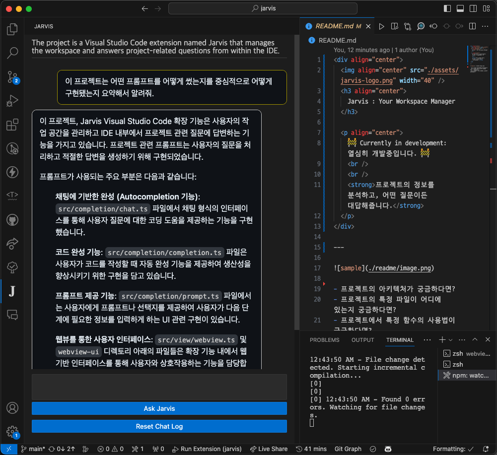

  
  <h3 align="center">
    Jarvis : Your Workspace Manager
  </h3>
  
  

    🚧 Currently in development: 열심히 개발중입니다. 🚧
     
     
    <strong>프로젝트의 정보를 분석하고, 어떤 질문이든 대답해줍니다.</strong>
  

---

 
 

- 프로젝트의 아키텍처가 궁금하다면?
- 프로젝트에서 특정 함수의 사용법이 궁금하다면?

### Beta 사용해보기

> Jarvis는 루트 디렉토리의 `.gitignore`를 인식해 해당 파일들을 제외하고 분석합니다. 안심하세요!

1. [이곳](./jarvis-0.0.1.vsix)에서 `jarvis-0.0.1.vsix` 파일을 다운로드 받습니다.
2. VSCode에서 `jarvis-0.0.1.vsix` 파일을 설치합니다. 아무 워크스페이스에 이 파일을 놓고, 우클릭 후 `Install Extension VSIX`를 클릭하면 됩니다.
3. VSCode settings에서 `Jarvis: Api Key For Open AI`를 검색하고, 자신의 Open AI API Key를 입력합니다.
4. 원하는 워크스페이스를 엽니다. Jarvis가 실행되지 않는다면 `Ctrl(cmd) + Shift + P`를 눌러 `Restart Jarvis`를 입력합니다.

 
 

### Jarvis 설정

VSCode settings에서 `Jarvis`를 검색하면 Jarvis의 설정을 변경할 수 있습니다.

- `Jarvis: Api Key For Open AI`: Open AI API Key를 넣어야 합니다.
- `Jarvis: Model`: Open AI의 모델을 선택할 수 있습니다. 기본값은 `gpt-4-1106-preview`입니다. 모델을 낮출수록 비용은 줄어들지만, 성능이 떨어집니다.

### Jarvis를 잘 사용하는 방법

- Jarvis는 처음부터 모든 코드를 파악하고 있지는 않습니다. Jarvis에게 궁금한 내용을 최대한 구체적(파일명, 타입명 등)으로 알려주세요.
- 프로젝트의 README.md를 잘 작성해주세요. Jarvis는 README.md를 프로젝트 분석에 사용합니다.
- 프로젝트의 파일명, 폴더명을 잘 작성해주세요. Jarvis는 디렉터리 구조를 프로젝트 분석에 사용합니다.

> Jarvis는 VSCode가 실행될 때 README.md의 내용, 프로젝트 디렉터리 구조나 파일, 폴더명의 변경에 반응해 프로젝트를 새로 분석합니다. 위 내용이 바뀌었을 경우 `Ctrl(cmd) + Shift + P`를 눌러 `Restart Jarvis` 명령어를 실행해주세요.

- `.gitignore`를 잘 작성해주세요. Jarvis는 `.gitignore`에 명시된 파일들을 프로젝트 분석에서 제외합니다. (모든 디렉터리에 있는 `.gitignore`를 잘 파싱하니 안심하세요!)
- 주기적으로 'Reset Chat Log' 버튼을 눌러주세요. 대화 내용이 길어질수록 토큰 소모가 커져 비용이 많이 발생할 수 있습니다.

### 실제 사용 예시 확인해보기

 
 

### 번외

